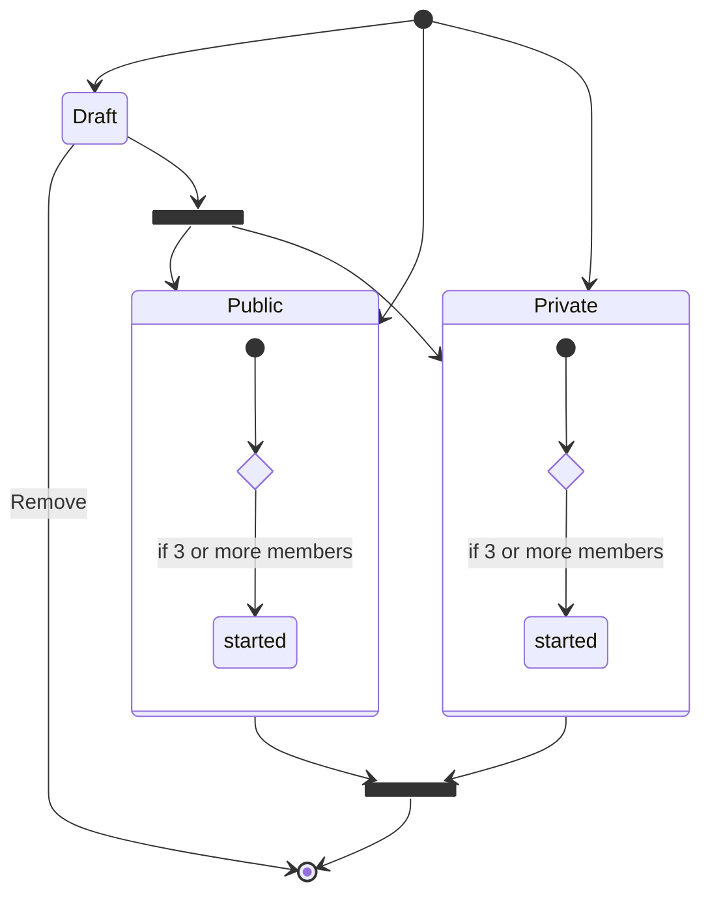

# Anonymous Giver Site

The project is inspired by "Secret Santa" (aka "Secret Nicholas")
Christmas tradition, but it does not focus on specific celebrations or
events. The primary objective is to create a place on the internet where
people can gather together in groups and anonymously give gifts to each
other.

## Key features

**Wish lists**

Any registered user can create and modify their own wish lists. The wish
list is generally private and is not visible to other users, unless they
are assigned as a gift-giver to the wish list owner.

**Many gift-giving campaigns**

Users can join multiple gift-giving campaigns without any limit.

**Personal reminders**

Users with empty wish lists will be prompted to place something there.
Similarly, dormant users will be prompted to join an existing
gift-giving campaign.

**Administration can't interfere**

Site admins provide moderation for wish lists and support gift-giving
campaigns. But they cannot create their own campaigns, or modify or
remove existing campaigns created by other users.

## Registration and authentication

-   Anonymous users may access any publicly available page.
-   Anonymous users can register by providing a username, fullname, and
    password.
-   Anonymous users can log in to their existing account.
-   Authenticated users can log out at any time.

## Wish lists

Wish lists are personal collections of desired gifts.

-   A wish list is created for any registered user, except admins.
-   Users must add at least one item to their wish list before using the
    site.
-   A wish list is available only to its owner and site admins.
-   A wish list is temporary available to other users assigned as a
    gift-giver to its owner.
-   Owners can add, modify, or remove entries in their wish lists.
-   Admins can mark any wish list item as restricted, which makes it act
    as a deleted one.

## Gift-giving campaigns

-   Non-admin users can create their own gift-giving campaigns.
-   Each campaign should have name, description and members list.
-   The campaign creator is automatically a member and cannot be
    excluded.
-   Campaigns status can be draft, public, private, or completed.
-   Admins or the campaign creator can run the campaign if it has at
    least 3 members.
-   Campaigns cannot be joined once they have started.
-   Any user, except the creator, can leave the campaign if it hasn't
    started.
-   The creator can remove non-running campaigns regardless of members
    list, creation time, or status.
-   Admins can remove the campaigns with 3 or fewer members that hasn't
    started within a specified time.
-   Admins can remove draft campaigns that haven't been published
    within a specified time.
-   The number of campaigns a user can be member of is limited by the
    number of items in their wish list.

**Draft campaigns**

-   No user can join a draft campaign.
-   Campaigns can are marked as drafts by default at creation.
-   The creator can publish the campaign by making campaign private or
    public.
-   Draft campaigns cannot be initiated.

**Public campaigns**

-   Public campaigns are accessible to both anonymous and authenticated
    users.
-   Authenticated users can join any public campaign, unless it hasn't
    started.

**Private campaigns**

-   Private campaign are available only to their members.
-   The campaign creator can share a join link with other users.
-   Once joined, the campaign becomes visible in the user's campaigns
    list.

**Completed campaigns**

Actually this means the campaign has been completed and archived. Admins
can remove archived campaigns at any time (campaigns clean-up). Running
campaigns cannot be manually moved to completed status. This is done
automatically.

**Campaign life-cycle**

## Running the gift-giving campaign

-   The option to start campaigns is available to their creators or
    admins.
-   Once the campaign has started, no one can join or leave it.
-   Each campaign member is assigned to give a gift to a randomly chosen
    person within the same campaign members list.

**Giver access for wish list**

-   The wish list of the assigned person becomes visible to the gift
    giver.
-   The giver can mark any single item within this list as a given gift.
-   After the gift is given, wish list returns to normal.
-   Wish list entry marked as given, cannot be changed by other givers.

**Multiple gifts**

Generally, gift-giving campaigns allow for one gift at a time. However,
if a user is assigned twice to the same giver from different campaigns,
the giver can mark as many entries as the number of assignments.

**Autocomplete**

Once all the assignments within a campaign are completed, the campaign
itself is considered to be completed.

## REST API

**All site functions** will be implemented within REST API.
